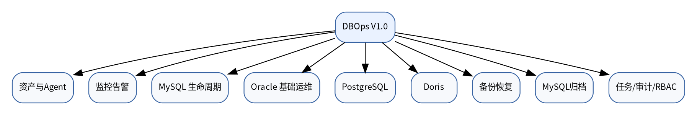
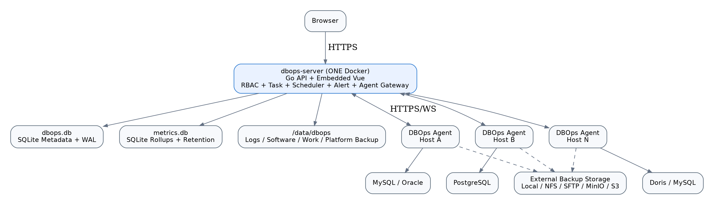
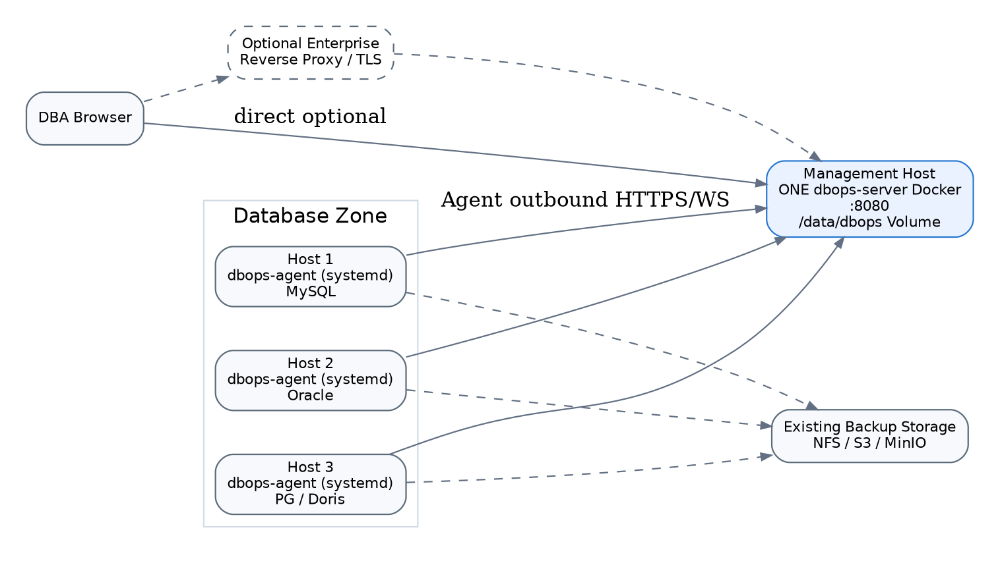
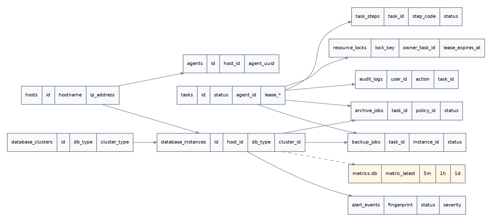
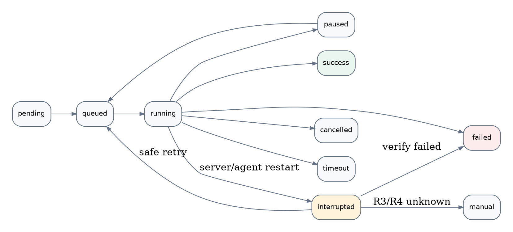
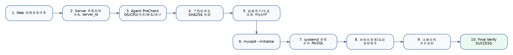
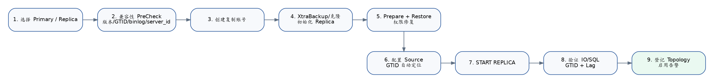
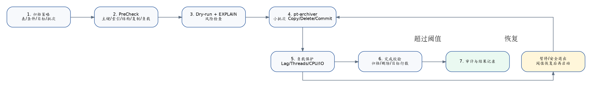
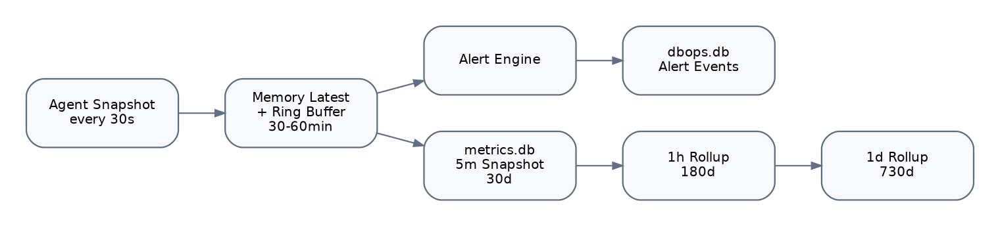

**文档类型：** 产品需求 + 总体架构 + 详细设计 + 数据库设计 + 接口设计 + 测试验收  
**版本：** V1.0  
**状态：** 单容器架构重规划，可进入研发评审  
**适用数据库：** Oracle / MySQL / PostgreSQL / Doris

## 目录

- 1. 文档目的与设计结论
- 2. 建设目标
- 3. 用户与角色
- 4. 功能架构
- 5. 总体架构
- 6. 部署拓扑与网络模型
- 7. 技术栈
- 8. 核心领域模型
- 9. 凭据与 Secret 设计
- 10. Agent 设计
- 11. 统一任务引擎
- 12. MySQL 生命周期总体设计
- 13. MySQL 安装详细设计
- 14. MySQL 参数与服务管理
- 15. MySQL GTID 主从详细设计
- 16. MySQL 复制监控
- 17. MySQL 备份与恢复
- 18. MySQL pt-archiver 数据归档详细设计
- 19. Oracle 详细设计
- 20. PostgreSQL 详细设计
- 21. Doris 详细设计
- 22. 监控系统设计
- 23. 告警系统设计
- 24. 备份恢复统一架构
- 25. API 设计
- 26. 前端页面详细设计
- 27. RBAC 和高危操作分级
- 28. 安全设计
- 29. 可用性与容灾
- 30. 日志与可观测性
- 31. 开发接口边界
- 32. 数据库迁移与版本管理
- 33. 部署设计
- 34. 测试策略
- 35. V1.0 验收标准
- 36. 开发计划与迭代拆分
- 37. 风险清单与设计对策
- 38. 后续版本预留
- 附录 A：推荐错误码
- 附录 B：推荐权限代码
- 附录 C：上线前最低检查清单
- 附录 D：配套文件

---

## 1. 文档目的与设计结论

本项目建设一套面向 DBA 和基础设施运维人员的数据库运维与生命周期管理平台。平台不是数据库开发客户端，也不提供通用 SQL Console。V1.0 的重点是把数据库资产、主机 Agent、监控告警、运维任务、备份恢复和可审计的自动化操作统一起来。

本次架构重规划的核心结论是：**V1.0 默认中心端采用单 Docker、单 Go 进程、嵌入式 Web、SQLite 元数据、本地持久化任务引擎、本地 Scheduler/Alert Engine，不依赖 PostgreSQL、Redis、Prometheus/VictoriaMetrics。** 被纳管数据库主机仍独立安装 `dbops-agent`。

默认部署只需要一个持久化目录：

```text
/data/dbops/
  dbops.db              # 资产、任务、策略、审计等业务元数据
  metrics.db            # 经过降采样后的历史监控趋势
  config/
  logs/
  software/
  task-work/
  platform-backup/
```

采用两个 SQLite 文件而不是一个文件，是为了隔离高频监控历史写入与关键业务事务；对用户而言仍然只有一个容器、一个 Volume，不增加外部依赖。

已经确认的产品边界如下：

- **MySQL** 是 V1.0 功能最完整的数据库：已有实例纳管、新安装、参数模板、服务启停、GTID 主从搭建、复制监控、XtraBackup / MySQL Shell / mysqldump 备份恢复，以及基于 **pt-archiver** 的历史数据归档。
- **Oracle** V1.0 以基础运维为主：纳管、监控、表空间和数据文件查看、新增 Datafile、扩大 Datafile、RMAN 备份、基础 Data Guard 状态。暂不做复杂 AWR/ASH、建库、RAC/ADG 自动部署。
- **PostgreSQL** V1.0 以纳管、监控、复制状态和备份恢复为主；这里的 PostgreSQL 指“被管理数据库”，不再作为平台自身依赖。
- **Doris** V1.0 以集群纳管、节点/容量/Tablet/Replica/Load/Compaction 监控以及 Repository/Snapshot 备份恢复为主。
- **数据归档只支持 MySQL**，核心执行工具为 pt-archiver；超大分区表预留 Partition Archive 扩展点。
- **不提供 SQL Console**，不承担通用 SQL 审核、结果集编辑和数据库开发客户端职责。
- **V1.0 不引入微服务**。PostgreSQL/Redis/VictoriaMetrics 只作为未来 HA/大规模部署 Profile 的可插拔实现。



## 2. 建设目标

### 2.1 业务目标

1. 建立统一数据库资产台账，明确主机、实例、集群、环境、责任域和版本。
2. 建立统一 Agent，减少对 SSH 临时脚本和人工操作的依赖。
3. 将高频、标准化、可验证的 DBA 操作转换为任务：安装、扩容、备份、恢复、归档、主从搭建。
4. 将数据库和主机指标统一监控，并提供数据库类型感知的告警。
5. 对所有变更操作保留完整操作人、参数、执行步骤、结果和日志。
6. MySQL 建立从“主机 -> 安装 -> 主从 -> 监控 -> 备份 -> 归档 -> 下线”的生命周期能力。
7. Oracle 优先解决日常最常见、风险相对可控的表空间容量运维。

### 2.2 非目标

V1.0 明确不做以下功能：

- SQL Console / 通用 SQL 执行器。
- 数据库 DevOps 变更发布平台。
- 自动 Failover、自动 VIP 漂移和脑裂仲裁。
- Oracle RAC / ADG 自动搭建。
- PostgreSQL 自动 VACUUM FULL / 自动索引重建。
- Doris 自动扩缩容。
- Oracle/PostgreSQL/Doris 数据归档。
- AI 自动修改生产数据库。

## 3. 用户与角色

| 角色 | 主要职责 | 典型权限 |
|---|---|---|
| SuperAdmin | 平台管理 | 全局配置、用户、凭据、软件仓库 |
| DBA | 数据库运维 | 安装、主从、表空间、备份、恢复、归档 |
| Operator | 日常运维 | 启停、任务执行、告警确认；限制高危恢复 |
| Viewer | 只读查看 | 资产、监控、任务、告警 |
| Auditor | 审计 | 审计日志、任务记录、配置变更历史 |

权限采用 **RBAC + 资源范围**。V1.0 最少支持按项目和环境限制资源可见范围，避免“测试环境 DBA 自动拥有生产权限”。

## 4. 功能架构

### 4.1 一级菜单

```text
Dashboard
资产管理
  主机
  数据库
  集群
  Agent
数据库管理
  MySQL
  Oracle
  PostgreSQL
  Doris
监控中心
告警中心
备份恢复
MySQL 数据归档
任务中心
审计日志
系统管理
  用户与角色
  软件仓库
  参数模板
  存储
  通知渠道
  系统设置
```

### 4.2 数据库能力矩阵

| 能力 | MySQL | Oracle | PostgreSQL | Doris |
|---|---|---|---|---|
| 已有实例纳管 | 支持 | 支持 | 支持 | 支持 |
| 平台安装 | **支持** | 不支持 | 不支持 | 不支持 |
| 参数模板 | **支持** | - | - | - |
| 主从/复制搭建 | **GTID 主从** | 不支持 | 不支持 | - |
| 复制监控 | 支持 | Data Guard 基础状态 | Streaming Replication | Replica 状态 |
| 日常容量管理 | DB/Table | **Tablespace/Datafile** | DB/Table | Disk/Tablet |
| 备份 | XtraBackup/Shell/dump | RMAN | pg_dump/pg_basebackup | Snapshot |
| 恢复 | 支持 | RMAN 基础恢复任务 | 支持 | RESTORE |
| 数据归档 | **pt-archiver** | 不支持 | 不支持 | 不支持 |
| SQL Console | 不支持 | 不支持 | 不支持 | 不支持 |

## 5. 总体架构



### 5.1 默认架构：一个中心端 Docker

中心端镜像 `dbops-server:<version>` 内含：

```text
Go HTTP/API Server
Vue 编译后的静态资源（go:embed）
Authentication / RBAC
Asset / CMDB
Task Engine
Scheduler
Alert Engine
Agent Gateway
Backup / Archive Orchestrator
SQLite Metadata Repository
SQLite Metrics Repository
File Log / Task Workspace
```

Web 前端不再单独部署 Nginx 容器。Vue 执行 `npm run build` 后嵌入 Go Binary，由同一 HTTP Server 提供静态资源与 `/api/v1`、`/ws`。

### 5.2 组件职责

**Embedded Web Frontend**：资产列表、安装向导、MySQL 拓扑、监控趋势、告警、备份、归档、任务日志等用户交互。前端永不保存完整数据库 Secret。

**DBOps Server**：单体 Go 进程，承担 API、认证授权、Repository、业务编排、任务状态机、Adapter 选择、Scheduler、Alert Engine、Agent Gateway、审计和静态 Web 服务。

**Metadata SQLite (`dbops.db`)**：保存用户、资产、实例、凭据密文、任务、策略、告警事件、备份/归档记录和审计日志。开启 WAL，所有结构变更通过 migration 管理。

**Metrics SQLite (`metrics.db`)**：只保存经过筛选与降采样的历史趋势。30 秒级原始状态主要用于实时页面和告警判断，不长期逐点落盘。

**Embedded Task Engine**：数据库 `tasks` 表是唯一事实来源；Go Worker Pool 负责执行。内存 Channel 只负责唤醒 worker，不承担持久化。Server 重启后根据数据库中的任务状态恢复。

**Embedded Scheduler**：读取备份/归档/巡检策略中的 `next_run_at`，在 Server 内触发任务；调度事实持久化在 SQLite，不依赖 Redis Cron。

**Embedded Alert Engine**：根据实时 Metric Snapshot 与规则进行判定、去重、恢复和通知；Alert Event 写入 `dbops.db`。

**DBOps Agent**：部署在被纳管主机，主动与 Server 建立连接，只执行白名单 Action；负责 OS 检查、数据库本机命令、备份工具、pt-archiver、文件系统和软件安装。

**External Storage**：备份文件可写 Local/NFS/SFTP/现有 MinIO/S3。平台默认部署不自动附带 MinIO，避免为了管理数据库再额外维护存储集群。

### 5.3 核心抽象接口

为了保证后续可从 Lite 升级到分布式版本，代码层不得直接把 SQLite/内存实现散落到业务代码中，至少定义：

```go
type MetadataRepository interface { /* asset/task/policy/audit */ }
type TaskQueue interface { Enqueue(...); Wake(...); Recover(...) }
type LockManager interface { Acquire(...); Release(...) }
type MetricsStore interface { PutLatest(...); AppendRollup(...); QueryRange(...) }
type SchedulerStore interface { Due(...); MarkScheduled(...) }
```

V1 默认实现分别为 `SQLiteRepository`、`EmbeddedTaskQueue`、`SQLiteLockManager`、`SQLiteMetricsStore`、`EmbeddedScheduler`。未来企业版可以提供 PostgreSQL、Redis 和 VictoriaMetrics 实现，而不修改数据库业务 Adapter。

## 6. 部署拓扑与网络模型



### 6.1 中心端

V1.0 默认中心端只部署一个容器：

```text
Browser -> dbops-server:8080 -> Agent Gateway
                  |
                  +-- /data/dbops/dbops.db
                  +-- /data/dbops/metrics.db
                  +-- /data/dbops/logs
                  +-- /data/dbops/software
```

如果企业已有 Nginx、HAProxy、Traefik 或统一网关，可在容器前做 HTTPS 终止；没有反向代理时也可以直接使用 Server 的 TLS 配置。

### 6.2 数据库主机

Agent 推荐以 systemd 原生进程部署，而不是 Docker。原因是 Agent 需要可靠访问本机文件系统、systemd、MySQL/Oracle 软件属主、RMAN/XtraBackup/pt-archiver 和磁盘信息。把 Agent 放进容器反而会引入大量 privileged mount。

### 6.3 网络原则

- Agent **主动连接** Server，数据库区不需要向管理区开放 Agent 入站端口。
- Server 不直接通过 SSH 对生产主机执行任意命令。
- Agent 访问本机数据库优先 Socket/Loopback；主从、远程备份、归档按业务拓扑访问远端数据库或存储。
- Agent 与 Server 使用 HTTPS/WebSocket，生产环境建议 TLS；Bootstrap Token 仅用于首次注册。
- 单容器中心端故障不会导致数据库业务停止；只影响管理、任务调度和监控。恢复容器并挂回 `/data/dbops` 后即可恢复平台事实状态。

## 7. 技术栈

| 层次 | V1.0 默认技术 |
|---|---|
| 前端 | Vue 3 + TypeScript + Vite + Element Plus + Pinia + ECharts |
| 后端 | Go + Gin + `database/sql`/sqlx |
| 前端部署 | `go:embed` 嵌入 Server Binary |
| Agent | Go + systemd |
| 业务元数据 | SQLite (`dbops.db`) + WAL |
| 监控历史 | SQLite (`metrics.db`) + 降采样/Retention |
| 任务队列 | Go Worker Pool + SQLite Durable Tasks |
| 锁 | SQLite Resource Lock + 进程内快速锁 |
| 调度 | Go Embedded Scheduler + 持久化 `next_run_at` |
| 告警 | Embedded Alert Engine |
| 平台日志 | JSON File + Rotation；任务关键事件写 SQLite |
| 备份存储 | Local / NFS / SFTP / MinIO / S3 |
| 身份认证 | JWT；预留 OIDC/LDAP |
| 中心端部署 | 单 Docker + 单 Volume |

### 7.1 SQLite 驱动与参数

建议使用无需 CGO 的 SQLite 驱动，方便构建 amd64/arm64 单一交付链。启动后强制执行：

```sql
PRAGMA journal_mode=WAL;
PRAGMA synchronous=NORMAL;
PRAGMA foreign_keys=ON;
PRAGMA busy_timeout=5000;
```

`dbops.db` 和 `metrics.db` 使用独立连接池；写连接数量应保守，避免把 SQLite 当成高并发 OLTP 数据库使用。平台本身绝大多数写操作属于任务状态和策略更新，符合这一模型。

### 7.2 仓库建议

```text
dbops-server/
dbops-agent/
dbops-web/
dbops-deploy/
```

Web 可以独立开发仓库，但 Release 阶段由 Server 构建流程把 `dist/` 嵌入 Go Binary。V1.0 不拆微服务。

## 8. 核心领域模型



业务元数据建表脚本见 `sql/schema.sqlite.sql`，监控历史结构见 `sql/metrics.sqlite.sql`。核心实体包括：

- `hosts` / `agents`：主机资产与 Agent 身份。
- `database_instances` / `database_clusters`：Oracle/MySQL/PG/Doris 实例与拓扑。
- `credentials`：加密凭据，仅保存密文。
- `tasks` / `task_steps` / `task_events`：统一任务事实。
- `resource_locks`：持久化资源互斥锁，替代 Redis Lock。
- `software_packages`：MySQL、XtraBackup、Percona Toolkit 等软件仓库。
- `mysql_replications`：MySQL 复制拓扑。
- `backup_policies` / `backup_jobs` / `restore_jobs`：数据保护。
- `archive_policies` / `archive_jobs`：MySQL pt-archiver 归档。
- `alert_rules` / `alert_events` / `silences`：告警。
- `audit_logs`：用户操作审计。
- `metric_latest` / `metric_snapshots_5m` / `metric_rollups_1h` / `metric_rollups_1d`：监控历史。

### 8.1 SQLite 业务库与监控库拆分

`dbops.db` 只保存需要强一致性和长期审计的事实；`metrics.db` 专门承载可重建的历史指标。这样即使历史指标库损坏或被清理，资产、备份、归档、任务和审计事实仍然完整。

### 8.2 database_instances 统一模型

`db_type` 使用：`mysql / oracle / postgresql / doris`。`managed_mode`：

- `imported`：已有数据库手工纳管。
- `installed`：由平台安装。
- `discovered`：Agent 自动发现后确认纳管。

同一 Host 可以承载多个实例，代码层禁止假定 `host == database`。

## 9. 凭据与 Secret 设计

平台数据库密码、复制账号、备份账号、对象存储密钥统一进入 `credentials`。数据库仅保存密文，推荐 AES-256-GCM；Master Key 来自环境变量、Vault 或企业 KMS，**不得与元数据库放在一起**。

禁止：

- 明文密码进入 URL 查询参数。
- 明文密码进入 task log、audit log、Agent 普通日志。
- Web 返回完整 Secret。
- Server 通过任意 Shell 将密码拼接到可被 `ps` 看见的命令行，能用受限临时 defaults-file 时优先使用配置文件并在任务结束删除。

## 10. Agent 设计

### 10.1 原则

Agent 是受控执行器，不是远程 Shell。所有能力通过 Action Registry 实现。完整 Action 列表见 `agent/agent-actions.yaml`。

严禁开放：

```text
shell.execute
sql.execute
file.delete_any
```

### 10.2 通信模型

1. Agent 首次启动使用 Bootstrap Token 注册。
2. Server 颁发持久身份凭据或证书。
3. Agent 建立 WebSocket 或长连接。
4. 每 30 秒发送心跳。
5. Server 创建任务后将 Action 投递给指定 Agent。
6. Agent 逐步上报状态、进度、日志和结果。
7. Server 将状态持久化，并通过 WebSocket 推送给前端。

### 10.3 请求结构

```json
{
  "request_id": "REQ-20260917-000001",
  "task_id": "TASK-20260917-000001",
  "action": "mysql.install",
  "protocol_version": "1.0",
  "timeout_seconds": 3600,
  "params": {}
}
```

### 10.4 响应结构

```json
{
  "task_id": "TASK-20260917-000001",
  "status": "running",
  "progress": 45,
  "step": {"code": "MYSQL_INITIALIZE", "name": "Initialize MySQL"},
  "message": "initialization completed"
}
```

### 10.5 幂等与并发

- MySQL 安装幂等键：`host_id + port`。
- Oracle Datafile 操作锁：`oracle_instance_id + datafile/tablespace`。
- 备份锁：同一数据库可按策略限制并行数。
- 恢复默认同一目标实例互斥。
- pt-archiver 默认同一源表只允许一个写入型归档任务。

Agent 重启后必须能恢复“任务状态查询”，Server 根据实际子进程/PID/marker 文件判断任务是否仍在运行，避免盲目将任务重新执行。

## 11. 统一任务引擎



### 11.1 设计原则

V1.0 不使用 Redis/Asynq。`dbops.db.tasks` 是任务唯一事实来源，内存队列只是“新任务到达”的通知机制。任何时候都不能因为进程内 Channel 丢失而丢任务。

### 11.2 状态机

```text
PENDING -> QUEUED -> RUNNING -> SUCCESS
                         |----> FAILED
                         |----> CANCELLED
                         |----> TIMEOUT
                         |----> PAUSED -> QUEUED
                         |----> INTERRUPTED -> QUEUED/FAILED/MANUAL
```

`INTERRUPTED` 用于 Server 或 Agent 重启后的恢复判断，避免把历史 `RUNNING` 任务盲目重新执行。

### 11.3 Worker Pool

Server 启动固定数量 worker，例如：

```yaml
task:
  workers: 8
  max_per_host: 2
  scan_interval_seconds: 2
```

worker 使用 SQLite Transaction 原子领取 `QUEUED` 任务并写入 `lease_owner/lease_expires_at`。同一 Host、实例、源表等互斥关系通过 `resource_locks` 持久化。

### 11.4 重启恢复

Server 启动时：

1. 扫描 `RUNNING/INTERRUPTED` 任务。
2. 如果是 Agent 长任务，向 Agent 查询 `task_id` 对应子进程/marker 状态。
3. Agent 仍在运行：恢复事件订阅并续租。
4. Agent 已完成：读取结果，执行 Verify 后收敛状态。
5. 无法确认且 Action 可安全重试：进入 `QUEUED`。
6. 破坏性 Action 无法确认：进入 `INTERRUPTED`，要求人工确认，不自动二次执行。

### 11.5 Step 模型

复杂任务拆固定 Step，每个 Step 定义 `execute()`、`verify()`、可选 `rollback()` 和 `recovery_policy`。数据库事实必须在 Step 成功后立即提交，不能只依赖内存状态。

### 11.6 调度器

备份、归档、巡检策略保存 `cron_expr`、`next_run_at` 和 `misfire_policy`。Scheduler 周期扫描到期策略并创建普通 Task，因此“定时任务”和“手工任务”进入同一执行链路。

### 11.7 审计要求

创建、暂停、恢复、取消、重试任务均记录审计。敏感参数先脱敏再写入 `audit_logs`。任务日志的大文本主要写滚动文件，关键状态/错误码写 SQLite，避免数据库被 stdout 填满。

## 12. MySQL 生命周期总体设计

MySQL V1.0 形成如下闭环：

```text
主机纳管
 -> Agent 在线
 -> 安装 MySQL / 纳管已有实例
 -> 参数模板
 -> GTID 主从
 -> 监控告警
 -> 备份恢复
 -> pt-archiver 归档
 -> 下线
```

### 12.1 软件仓库

平台统一管理以下软件：

- MySQL Server。
- Percona XtraBackup。
- Percona Toolkit（pt-archiver）。
- MySQL Shell。

兼容关系配置在 `software_packages.compatibility`，安装和备份前动态验证，不在 Go 代码中写死“某版本一定匹配某版本”。软件包记录 SHA256，Agent 下载后强制校验。

## 13. MySQL 安装详细设计



### 13.1 安装向导输入

- 目标 Host。
- MySQL 版本。
- 端口。
- BaseDir、DataDir、LogDir、BinlogDir、TmpDir/RunDir。
- 字符集与 Collation。
- 参数模板。
- 初始管理员凭据生成策略。
- 是否预创建监控、备份、复制账号。

### 13.2 PreCheck

安装前至少检查：

| 检查项 | 阻断条件 |
|---|---|
| Agent | Offline |
| OS/Arch | 软件仓库无兼容包 |
| CPU/内存 | 不满足最低模板要求 |
| 端口 | 已监听 |
| DataDir | 存在有效 MySQL 数据目录 |
| 磁盘 | 低于最低容量/预留空间 |
| mysqld | 已存在冲突进程 |
| systemd unit | 同名冲突 |
| 用户/目录权限 | 无法创建或不可写 |
| 时间同步 | 严重偏差时告警/阻断可配置 |

### 13.3 server_id

由平台集中分配 `server_id`，不根据 IP 简单拼接。未开启复制时仍建议预分配，方便后续直接创建主从。

### 13.4 参数模板

模板使用受控变量，例如：

```text
{{PORT}}
{{SERVER_ID}}
{{DATADIR}}
{{BINLOGDIR}}
{{INNODB_BUFFER_POOL_SIZE}}
{{MAX_CONNECTIONS}}
```

用户可以覆盖允许覆盖的参数。必须建立参数黑名单，例如禁止通过模板修改 Agent 自身文件路径或注入多行任意 Shell。

### 13.5 安装 Steps

1. `CHECK_AGENT`
2. `CHECK_OS_ARCH`
3. `CHECK_PORT`
4. `CHECK_DATADIR`
5. `CHECK_DISK`
6. `ALLOCATE_SERVER_ID`
7. `DOWNLOAD_PACKAGE`
8. `VERIFY_SHA256`
9. `CREATE_MYSQL_USER`
10. `CREATE_DIRECTORIES`
11. `INSTALL_PACKAGE`
12. `RENDER_CONFIG`
13. `VALIDATE_CONFIG`
14. `INITIALIZE_DATABASE`
15. `INSTALL_SYSTEMD`
16. `START_DATABASE`
17. `VERIFY_DATABASE`
18. `INITIALIZE_ACCOUNTS`
19. `REGISTER_INSTANCE`
20. `ENABLE_METRICS`
21. `FINAL_VERIFY`

### 13.6 回滚

安装失败允许清理 systemd 和未使用的二进制软链接，但**默认不删除 DataDir**。真正数据删除必须使用独立高危操作，并要求明确输入实例名二次确认。

## 14. MySQL 参数与服务管理

V1.0 支持服务：Start / Stop / Restart。Stop/Restart 属于高风险操作，生产环境建议二次确认，并提示当前连接数、活动事务数和复制角色。

参数管理分两类：

- **模板参数**：新安装时生成。
- **运行参数展示**：展示关键变量及与模板差异。

V1.0 不做任意参数在线 SET GLOBAL；后续可以做“白名单参数修改 + 是否需要重启”的变更模型。

## 15. MySQL GTID 主从详细设计



### 15.1 V1.0 范围

仅支持 GTID 复制，支持一主一从和一主多从。主从自动切换不属于 V1.0。

### 15.2 创建前检查

Primary：

- 数据库在线。
- GTID 打开。
- Binlog 打开。
- `binlog_format=ROW`。
- `server_id` 唯一。
- 克隆工具可用。
- 无阻断备份的已知问题。

Replica：

- 数据库版本兼容。
- `server_id` 唯一。
- 数据目录可安全初始化。
- 容量足够。
- 不承载需保留的现有业务数据。
- MySQL 服务可控。

### 15.3 初始化方式

V1.0 主要支持：

1. **XtraBackup**：推荐用于中大型数据库和生产环境。
2. **MySQL Shell Dump/Load**：适合相对较小数据量或特定场景。

平台根据数据库版本和软件仓库兼容矩阵选择允许的 XtraBackup 版本。复制任务本身不应假设“最新 XtraBackup 一定兼容所有 MySQL”。

### 15.4 主从 Steps

1. Primary/Replica PreCheck。
2. 创建/获取复制凭据。
3. 从 Primary 或指定健康 Replica 生成一致性基线。
4. 传输/流式恢复至 Replica。
5. Prepare、权限修复、MySQL 启动。
6. 配置 `CHANGE REPLICATION SOURCE TO ... SOURCE_AUTO_POSITION=1`（具体语法由数据库版本 Adapter 生成）。
7. Start Replica。
8. 验证 IO Thread、SQL Thread、GTID、Lag。
9. 创建 `database_clusters` 和 `mysql_replications` 关系。
10. 自动启用复制告警。

### 15.5 故障处理

复制创建失败后默认保留 Replica 数据和日志供排查，不自动重置 Primary。涉及 `RESET REPLICA ALL`、删除数据目录等破坏性动作必须是显式修复流程。

## 16. MySQL 复制监控

持续采集：

- IO Thread 状态。
- SQL Thread 状态。
- Replication Lag。
- Source UUID。
- Retrieved/Executed GTID。
- Last IO/SQL Error。
- Replica 连接状态。

页面提供拓扑图，节点显示角色、版本、在线状态、Lag 和关键告警。V1.0 拓扑是“事实展示”，不实现自动主库选举。

## 17. MySQL 备份与恢复

### 17.1 备份引擎

| 引擎 | 用途 |
|---|---|
| XtraBackup | 生产物理热备、全量/增量、创建 Replica 基线 |
| MySQL Shell | 并行逻辑 Dump/Load |
| mysqldump | 小库、兼容性和简单逻辑备份 |

### 17.2 策略模型

策略字段包括：引擎、类型、周期、保留期、压缩、并发、限速、目标存储、是否从 Replica 备份等。

备份成功并不等于可恢复。建议保留三层状态：

```text
BackupCompleted
ChecksumVerified
RestoreVerified
```

V1.0 至少实现备份完成与文件/元数据校验，恢复演练可以配置为定期任务。

### 17.3 恢复

恢复默认支持“恢复到新实例/测试实例”。生产原实例覆盖恢复必须提高风险等级，前置检查活动连接、当前备份、目标目录和可回退方案。

## 18. MySQL pt-archiver 数据归档详细设计



### 18.1 定位

pt-archiver 用于低影响地从 MySQL 表中顺序“啃”出符合条件的历史记录，可写到另一张表或文件，并按策略删除源记录。平台不重新实现其行级扫描算法，而是提供安全的策略编排、PreCheck、限流、状态跟踪和审计。

### 18.2 支持的归档模式

**V1.0 优先支持：**

- 源业务表 -> 同实例历史表。
- 源业务表 -> 独立历史 MySQL 实例/数据库。

**扩展：**

- pt-archiver `--file` -> 文件落地 -> 压缩/转换 -> MinIO/NFS。
- 超大分区表 -> Partition Archive Adapter。

### 18.3 策略字段

- Source Instance / Database / Table。
- `where_template`，例如 `create_time < :cutoff`。
- Retention Days。
- Destination Type / Instance / Database / Table。
- `batch_size` / `txn_size`。
- `sleep_ms`。
- `max_replication_lag`。
- `max_threads_running`。
- CPU/IO 保护阈值。
- Delete Source。
- Schedule。

### 18.4 安全 PreCheck

1. 源和目标数据库在线。
2. 表存在。
3. 源表具备稳定唯一键，优先 PRIMARY KEY。
4. 目标表列兼容。
5. 归档条件字段存在。
6. 对生成的访问路径执行 `--dry-run` 并对关键 SELECT 做 EXPLAIN 风险判断。
7. 检查 pt-archiver 实际会使用的索引；避免每批重复全表扫描。
8. 检查复制状态和 Lag。
9. 检查目标存储容量。
10. 检查当前负载是否允许开始。

重要说明：不能简单规定“where 字段必须单列索引”作为唯一判断。pt-archiver 会基于索引进行前向扫描，平台应结合 PRIMARY/指定索引、where 条件与 EXPLAIN 判断真实访问路径。策略页面可以提供“推荐索引”提示，但阻断规则以执行计划风险为依据。

### 18.5 执行模板

内部命令示意：

```bash
pt-archiver \
  --source F=/run/dbops/src.cnf,D=order_db,t=trade_order \
  --dest F=/run/dbops/dst.cnf,D=archive_db,t=trade_order \
  --where "create_time < '2026-01-01 00:00:00'" \
  --limit 5000 \
  --commit-each \
  --sleep 0.2 \
  --statistics \
  --progress 10000 \
  --sentinel /run/dbops/pt-archiver-TASK001.stop
```

涉及复制延迟时，由 Adapter 按部署环境生成 `--check-replica-lag` / `--max-lag` 等可用选项。密码放受限临时配置文件，不写任务日志。

### 18.6 暂停与恢复

优先采用“安全退出 + 重新启动”，而不是长时间 SIGSTOP：

- 平台触发 Sentinel 或 SIGTERM，使 pt-archiver 正常完成当前循环并退出。
- Job 标记 `PAUSED`。
- 恢复时重新进行轻量 PreCheck，并按原条件重新启动。
- 因已归档行通常已被删除或目标表已有唯一约束，任务从剩余数据继续。

### 18.7 负载保护

动态采集：Replication Lag、Threads_running、Host CPU、Disk IO。达到高阈值时暂停；恢复阈值必须低于暂停阈值并满足稳定时间，避免频繁抖动，例如：

```text
暂停：Threads_running > 50 或 Lag > 30s
恢复：Threads_running < 30 且 Lag < 10s 持续 5 分钟
```

### 18.8 数据一致性

- 目标表必须有合理唯一键避免重复。
- 统计 Archived Rows / Deleted Rows / Destination Impact。
- 归档结束执行校验；校验不通过不能标记 SUCCESS。
- 对涉及关联表的一致性归档，V1.0 不自动推断外键业务关系，需要通过策略组或后续 Plugin 扩展实现。

## 19. Oracle 详细设计

### 19.1 V1.0 范围

- 实例基本状态、版本、Open Mode、启动时间。
- Tablespace 使用率。
- Datafile 信息。
- 新增 Datafile。
- 扩大 Datafile。
- RMAN 备份任务。
- Data Guard Role、Transport/Apply Lag、MRP/RFS 基础状态。

### 19.2 新增 Datafile

页面输入：Tablespace、目录、文件名、初始大小、Autoextend、Next、Maxsize。

PreCheck：

- Tablespace 是否存在且可加文件。
- 文件名是否重复。
- 目录是否存在、Oracle 用户是否可写。
- 磁盘剩余量和预留阈值。
- 参数大小合法性。

Server 生成结构化 Action，Oracle Adapter 在 Agent 内生成受控 SQL。V1.0 不允许用户输入任意 ALTER SQL。

### 19.3 Resize

V1.0 **仅允许扩大，不允许缩小**。目标大小必须大于当前大小，并检查文件系统余量。缩小涉及 HWM 和对象分布，留待后续版本。

### 19.4 RMAN

策略支持 Full、Level 0、Level 1、Archivelog。平台负责调度、日志、保留策略和备份元数据，不重新实现 RMAN 的恢复语义。

## 20. PostgreSQL 详细设计

V1.0 支持：实例状态、连接、Active Session、Long Transaction、Lock/Blocking、WAL、Streaming Replication、Replication Slot、Database/Table/Index Size。

备份：

- `pg_dump`：逻辑库级备份。
- `pg_basebackup`：物理基础备份。

恢复任务与 MySQL 共享统一 `restore_jobs` 模型，但执行器由 PostgreSQL Adapter 实现。V1.0 不自动执行 VACUUM FULL、REINDEX 或数据归档。

## 21. Doris 详细设计

Doris 以 Cluster 为核心纳管：FE / BE / CN。监控包括节点 Alive、磁盘、Tablet、Replica、Query、Load Job、Compaction。

备份使用 Repository + Snapshot 模型。平台创建/引用 Repository、提交 BACKUP、轮询 SHOW BACKUP；恢复提交 RESTORE 并跟踪 SHOW RESTORE。由于任务本身是异步的，Agent/Adapter 不能在“SQL 提交成功”时直接把平台 Task 标记成功，而要等待 Doris 作业完成。

## 22. 监控系统设计

### 22.1 为什么不默认引入 Prometheus/VictoriaMetrics

V1.0 的目标是日常 DBA 运维平台，不是通用监控平台。为了保持一个 Docker 即可部署，原始 15~30 秒指标不全部长期存储；平台只保留“实时状态 + DBA 真正需要的趋势”。

### 22.2 数据分层



```text
Agent 30s Snapshot
      |
      +--> Server Memory Latest/Ring Buffer -> Dashboard / Alert
      |
      +--> 5min 聚合 -> metrics.db.metric_snapshots_5m
                    -> 1h Rollup
                    -> 1d Rollup
```

`dbops.db` 不存时序指标，只存告警事件和容量类事实。

### 22.3 默认保留策略

| 粒度 | 默认保留 | 用途 |
|---|---:|---|
| 30s 原始状态 | 内存最近 30~60 分钟 | 实时图与告警 |
| 5m 聚合 | 30 天 | 短期趋势、故障回看 |
| 1h 聚合 | 180 天 | 月度趋势 |
| 1d 聚合 | 730 天 | 容量增长、长期趋势 |

Retention 可配置。聚合采用“一个资源一个 JSON Snapshot 行”，而不是“每个 metric 一行”，显著减少 SQLite 行数。

### 22.4 采集周期

| 类型 | 建议周期 |
|---|---|
| Agent Heartbeat | 30s |
| 主机 CPU/内存/磁盘 | 30s |
| 数据库 Up/连接/复制状态 | 30s |
| Oracle 表空间/容量 | 5m |
| 数据库/表大小 | 1h/1d |
| 备份/归档任务 | Event + 5-10s 进度 |

### 22.5 默认历史指标

MySQL：Connections、Threads_running、QPS/TPS、Buffer Pool 使用率、Replication Lag、Database Size。

Oracle：Session/Process、Tablespace 使用率/容量、TEMP/UNDO、Data Guard Lag。

PostgreSQL：Connections、Active、Longest Transaction、WAL/Slot、Replication Lag、Database Size。

Doris：FE/BE Alive、Disk、Tablet/Replica、Query、Load、Compaction。

### 22.6 升级点

当实例数量、指标规模或监控保留需求超出 SQLite 设计范围时，通过 `MetricsStore` 切换 VictoriaMetrics/Prometheus Remote Write；业务模块和前端 API 不变。

## 23. 告警系统设计

告警引擎运行在 `dbops-server` 进程内。默认告警见 `config/default-alert-rules.yaml`。告警生命周期：

```text
FIRING -> ACKNOWLEDGED -> RESOLVED
```

规则以实时 Metric Snapshot 为输入；持续时间判断维护在内存并周期性 checkpoint 到 SQLite。告警事件使用 fingerprint 去重，恢复时发送恢复通知。

必须支持静默、维护窗口、重复通知间隔、抑制和恢复通知。V1.0 通知渠道为 Email、Webhook，后续扩展企业微信、钉钉、飞书。

Server 重启后根据最近 `metric_latest`、未恢复 `alert_events` 和规则状态重新计算，不依赖 Redis。

## 24. 备份恢复统一架构

### 24.1 BackupAdapter

统一接口概念：

```go
type BackupAdapter interface {
    Precheck(ctx context.Context, req BackupRequest) (*PrecheckReport, error)
    Backup(ctx context.Context, req BackupRequest, reporter Reporter) (*BackupResult, error)
    Verify(ctx context.Context, backup BackupArtifact) (*VerifyResult, error)
    Restore(ctx context.Context, req RestoreRequest, reporter Reporter) (*RestoreResult, error)
}
```

### 24.2 StorageAdapter

支持 Local、NFS、SFTP、MinIO/S3。所有备份文件记录路径、大小、Checksum、所属 Job、过期时间。

### 24.3 Retention

清理任务只删除“已过期且不被增量链依赖”的备份。增量备份存在父子关系时不得仅按文件日期删除。

## 25. API 设计

完整草案见 `api/openapi.yaml`。规则：

- `/api/v1` 版本化。
- 长任务返回 HTTP 202 + `task_id`。
- 查询接口返回事实状态，不同步等待长任务。
- Action 接口必须通过 RBAC。
- 前端使用 `/ws/tasks/{task_id}` 或统一 Task Event WebSocket 获取实时进度。

统一响应建议：

```json
{
  "code": "OK",
  "message": "success",
  "data": {},
  "request_id": "..."
}
```

错误使用稳定 `error_code`，禁止前端根据中文错误文本写业务逻辑。

## 26. 前端页面详细设计

### 26.1 Dashboard

第一屏显示数据库总数、按类型数量、异常实例、当前 P1/P2、备份失败、运行中归档。下方展示数据库健康分布、重要告警、备份任务和 MySQL 归档状态。

### 26.2 主机详情

Tab：概览 / 磁盘 / 数据库实例 / Agent / 任务 / 监控。若主机无 MySQL，可显示“安装 MySQL”入口。

### 26.3 MySQL 安装向导

1. 主机与版本。
2. 端口与目录。
3. 参数模板。
4. 账号策略。
5. PreCheck 报告。
6. 配置确认。
7. 实时安装任务。

### 26.4 MySQL 主从

选择 Primary / Replica -> 兼容检查 -> 初始化方式 -> 确认 -> 实时任务 -> 拓扑页。

### 26.5 归档策略

选择源实例/库/表，平台读取表结构和索引；配置条件、目标、批次和保护阈值；保存前执行 dry-run 风险报告。执行页展示归档行数、删除行数、速度、Lag、负载和暂停原因。

### 26.6 Oracle 表空间

Tablespace 列表 -> 点击进入 Datafile 列表 -> “新增 Datafile”或“扩容”。页面明确展示操作前后磁盘空间预测。

### 26.7 Task 详情

必须显示：总体状态、进度、固定 Steps、实时日志、参数摘要、执行节点、开始/结束、错误码、重试/取消操作。

## 27. RBAC 和高危操作分级

建议风险分级：

- R0：只读。
- R1：低风险变更，如手工触发备份。
- R2：中风险，如安装新实例。
- R3：高风险，如 Restart、Datafile 扩容、创建复制、开始删除型归档。
- R4：关键，如生产恢复、数据目录清理（V1.0 可限制 SuperAdmin/DBA）。

生产环境 R3/R4 操作至少要求二次确认。V1.1 可增加审批工作流，而不是 V1.0 首期强制实现复杂审批中心。

## 28. 安全设计

1. 全链路 HTTPS。
2. Agent 主动出站，不暴露远程 Shell。
3. Action 白名单。
4. 凭据加密和日志脱敏。
5. JWT 短 Access Token + Refresh Token；预留 OIDC。
6. 数据库管理账号最小权限，监控账号与变更账号分离。
7. 恢复、停止服务、数据清理等高危操作额外授权。
8. 上传软件包必须 SHA256 校验，可增加签名验证。
9. Server/Agent 所有文件路径使用允许目录校验，避免 Path Traversal。
10. `where_template` 不允许直接拼接任意多语句 SQL；使用受限表达式/参数化策略生成最终 where。
11. Web 不展示完整数据库密码。
12. Agent 临时 Secret 文件权限 0600，任务完成立即删除。

## 29. 可用性与容灾

V1.0 默认中心端单实例，因此设计目标不是“平台自身零停机”，而是“平台故障不影响数据库业务、中心端能快速恢复、任务不重复破坏性执行”。

### 29.1 中心端故障

- 数据库业务与数据库自身复制不依赖 DBOps Server 存活。
- Agent 断开 Server 后停止接收新变更任务；正在执行的本地长任务按 Action 的断线策略继续或安全停止。
- `/data/dbops` 是中心端恢复关键。重建容器后挂载同一目录即可恢复资产与任务事实。

### 29.2 SQLite 备份

不能在运行时简单 `cp dbops.db` 并假设一致。平台内置“平台自身备份”任务，通过 SQLite Online Backup API 或一致性 checkpoint/backup 方法产生：

```text
platform-backup/YYYYMMDD-HHMM/
  dbops.db
  metrics.db            # 可选；历史指标可以不进入高频备份
  manifest.json
  sha256.txt
```

`dbops.db` 建议每日备份并在升级 migration 前强制备份。`metrics.db` 可以按较低等级保护，因为它可从新数据重新积累。

### 29.3 任务恢复

Server/Agent 重启后不自动重复执行未知状态的 R3/R4 Action。通过 Task Lease、Agent Marker、Step Verify 和恢复策略判断是继续、重试还是人工介入。

### 29.4 HA 扩展

未来若明确要求平台自身 HA，再启用 Enterprise Profile：多 Server + PostgreSQL + Redis/分布式锁 + VictoriaMetrics。V1 的领域接口为这一迁移保留兼容层。

## 30. 日志与可观测性

Server/Agent 使用结构化 JSON 日志，字段至少包含 timestamp、level、request_id、task_id、agent_id、action、step_code、message。Secret 字段在 logger 层统一脱敏。

默认日志写：

```text
/data/dbops/logs/server.log
/data/dbops/logs/task/<task_id>.log
Agent: /var/log/dbops-agent/agent.log
```

启用大小/天数轮转。任务详情页通过 Server Tail/事件流读取当前任务日志，不要求引入 Loki。

平台自身 Dashboard 至少展示 API 错误率、运行任务数、Queued 数、Agent Online 数、SQLite DB 大小、WAL 大小、最近平台备份、Scheduler 延迟和 Metrics Retention 状态。

## 31. 开发接口边界

### 31.1 DatabaseAdapter

```go
type DatabaseAdapter interface {
    TestConnection(context.Context) error
    Status(context.Context) (InstanceStatus, error)
    CollectMetrics(context.Context) ([]Metric, error)
}
```

特有能力拆独立接口，例如：

```go
type OracleCapacityManager interface {
    ListTablespaces(context.Context) ([]Tablespace, error)
    AddDatafile(context.Context, AddDatafileRequest) error
    ResizeDatafile(context.Context, ResizeDatafileRequest) error
}
```

避免把所有数据库能力塞进一个巨大接口。

### 31.2 Reporter

长任务通过 Reporter 上报：

```go
StepStart(code, name string)
Progress(percent int, message string)
Log(level, message string)
StepSuccess(code string, output any)
StepFail(code, errorCode string, err error)
```

## 32. SQLite Migration 与版本管理

`dbops.db` 和 `metrics.db` 都必须通过 Migration 管理，禁止上线后手工修改表结构。Server Binary 内嵌 migration 文件，启动时：

```text
读取 schema_version
 -> 检查可升级路径
 -> 执行升级前平台备份
 -> BEGIN/执行 migration
 -> 更新版本
 -> 启动业务服务
```

Release 包含：Migration SQL、向后兼容说明、Agent/Server 协议版本、软件仓库兼容矩阵更新。

SQLite Repository 层避免依赖 PostgreSQL 专用 SQL。JSON 字段以 TEXT 保存，业务层统一序列化；时间统一保存 UTC RFC3339 或 Unix Milliseconds。这样未来迁移 PostgreSQL 更容易。

## 33. 部署设计

### 33.1 V1.0 默认部署：一个 Docker

推荐直接运行：

```bash
docker run -d \
  --name dbops \
  --restart unless-stopped \
  -p 8080:8080 \
  -v /data/dbops:/data/dbops \
  -e DBOPS_MASTER_KEY='replace-with-strong-secret' \
  dbops/dbops-server:1.0.0
```

也提供单服务 Compose 示例，见 `config/docker-compose.example.yml`。

镜像内部：

```text
/usr/local/bin/dbops-server
/app/migrations/
/app/defaults/
# Vue dist 使用 go:embed 编译进入 binary
```

### 33.2 持久化目录

```text
/data/dbops/
  dbops.db
  metrics.db
  config/server.yaml
  logs/
  software/
  task-work/
  platform-backup/
```

容器更新时只替换镜像，不删除 `/data/dbops`。

### 33.3 Agent 安装

推荐：

```text
/usr/local/bin/dbops-agent
/etc/dbops-agent/agent.yaml
/etc/systemd/system/dbops-agent.service
/var/lib/dbops-agent/
/var/log/dbops-agent/
```

Agent 使用独立低权限 OS 用户；需要 MySQL/Oracle 特权操作时通过最小 sudoers 白名单或数据库软件属主上下文执行，不长期以 root 运行全部逻辑。

### 33.4 反向代理与 HTTPS

容器可以直接监听 8080。生产环境优先复用企业已有 Nginx/Ingress/负载均衡做 TLS；平台自身也预留 `tls.cert/tls.key` 配置。单容器模式不强制再启动一个 Nginx。

### 33.5 Lite 到 Enterprise 的升级路径

```text
Lite:
  SQLiteRepository + EmbeddedTaskQueue + SQLiteMetricsStore

Enterprise:
  PostgreSQLRepository + RedisTaskQueue + VictoriaMetricsStore
```

迁移工具按 Repository 接口导出/导入资产、任务、策略和审计，不要求修改数据库 Adapter 或 Agent Action 协议。

## 34. 测试策略

### 34.1 单元测试

覆盖参数校验、RBAC、SQLite Repository、Task 状态机、资源锁、Cron/Misfire、告警表达式、Secret 脱敏和 Adapter 逻辑。

### 34.2 SQLite 专项测试

必须包含 WAL 模式、并发读写、busy timeout、进程异常退出、磁盘满、WAL 异常增长、migration 回滚、Online Backup、数百万历史指标行查询和 Retention 删除性能测试。

### 34.3 Task 恢复测试

模拟 Server 在 MySQL 安装、XtraBackup、pt-archiver、Oracle Add Datafile 各步骤被强制 kill。重启后验证不会重复执行破坏性步骤，状态最终可以被 Verify 收敛。

### 34.4 集成测试

使用 Oracle/MySQL/PostgreSQL/Doris 测试环境验证纳管、监控、备份；MySQL 额外验证安装、GTID 主从、归档；Oracle 验证 Datafile Add/Resize。

### 34.5 升级测试

每个正式版本都必须从“上一发布版本的 `/data/dbops` 快照”启动并完成 migration；验证失败必须保持旧数据库可恢复。

### 34.6 安全测试

覆盖 JWT/RBAC 越权、Action 白名单、路径穿越、敏感字段泄漏、恶意参数、压缩包路径、Agent 注册 Token 重放等。

## 35. V1.0 验收标准

### 平台安装与恢复

- 一条 `docker run` 或一个单服务 Compose 可以启动中心端，不要求用户预先安装 PostgreSQL、Redis、Prometheus、Nginx。
- 首次启动自动创建/migrate `dbops.db` 与 `metrics.db`。
- 挂载 `/data/dbops` 后容器删除重建，资产、任务、策略和审计数据保持完整。
- 平台自身备份可以生成可恢复的 SQLite 快照。

### 平台核心

- Host/Agent/Database 可纳管；Agent 断线可告警。
- 所有变更操作以 Task + Step 执行，日志与审计可追踪。
- Server 重启后 Queued 任务可继续，未知 Running 任务不会盲目二次执行。
- 监控实时状态可显示；5m/1h/1d 趋势可查询；Retention 正常。

### MySQL

- Web 一键安装、自动初始化和自动纳管。
- GTID 主从搭建、拓扑和复制监控可用。
- XtraBackup / 逻辑备份任务可执行和追踪。
- pt-archiver PreCheck、执行、负载保护、暂停/恢复、归档结果可审计。

### Oracle

- 纳管、基础监控、Tablespace/Datafile 查询可用。
- 新增 Datafile 与扩大 Datafile 有 PreCheck、Verify 和审计。
- RMAN 备份任务可执行和追踪。

### PostgreSQL / Doris

- 基础监控可用。
- 复制/集群状态可查看。
- 备份任务可执行和跟踪。

## 36. 开发计划与迭代拆分

### Sprint 0：单容器工程基础

完成 Go Server 骨架、Vue embed 构建、SQLite Repository、Migration、JWT/RBAC、统一错误码、配置加载和 Docker Image。

### Sprint 1：Host + Agent + Durable Task

打通 `Web -> Server -> SQLite Task -> Worker -> Agent -> Event -> Web`，实现资源锁、任务 Lease、重启恢复，先用 `host.info/host.echo` 验证。

### Sprint 2：Embedded Metrics + Alert

完成 Agent Snapshot、内存 Latest、5m/1h/1d Rollup、Retention、Alert Engine、Email/Webhook。

### Sprint 3：MySQL 安装

软件仓库、参数模板、server_id、PreCheck、安装、systemd、自动纳管。

### Sprint 4：MySQL 主从

XtraBackup Adapter、GTID 主从、拓扑、复制监控。

### Sprint 5：Oracle 基础运维

Tablespace、Datafile、Add/Resize、RMAN。

### Sprint 6：统一备份恢复

BackupPolicy/Job/StorageAdapter，MySQL/Oracle/PG/Doris 接入，平台自身 SQLite Backup。

### Sprint 7：MySQL pt-archiver

PreCheck、dry-run、任务、限流、暂停恢复、验证。

### Sprint 8：安全、恢复与验收

审计、Secret 脱敏、Task Crash Recovery、SQLite 压力/迁移测试、安装包和文档。

## 37. 风险清单与设计对策

| 风险 | 后果 | 对策 |
|---|---|---|
| SQLite 写竞争 | Task/指标写延迟 | 元数据与指标拆两个 DB、WAL、批量写、单写者策略 |
| metrics.db 过大 | 查询/磁盘压力 | 5m 聚合、1h/1d Rollup、Retention、只保存关键历史指标 |
| WAL 长时间不 checkpoint | 磁盘增长 | 定时 checkpoint、平台自监控、阈值告警 |
| 单中心端宕机 | 暂停管理/调度 | DB 业务不依赖中心端；Volume 持久化；容器快速重建 |
| Server 重启重复执行 | 二次变更 | Durable Task + Lease + Agent Marker + Verify + INTERRUPTED |
| Agent 变成远程 Shell | 平台失陷扩大影响 | Action 白名单，禁止任意命令/SQL |
| 工具版本不兼容 | 备份/安装失败 | compatibility matrix + PreCheck |
| 安装重复执行 | 覆盖已有库 | 幂等键 + DataDir/Port 检查 |
| 主从初始化误清数据 | 数据损失 | Replica 空库检查 + 高危确认 |
| pt-archiver 扫描低效 | OLTP 抖动 | dry-run + EXPLAIN + 索引策略 + 限流 |
| pt-archiver Lag 增大 | 从库延迟 | max-lag + 平台负载保护 |
| Oracle Resize 缩小 | ORA 错误/风险 | V1 只允许扩大 |
| 备份“成功但不可恢复” | 灾难时失败 | Checksum + Restore Verification |
| Secret 泄漏 | 安全事件 | AES-GCM、0600 临时文件、日志脱敏 |

## 38. 后续版本预留

### 38.1 功能演进

V1.1/V2 可增加 MySQL Planned Switchover、MGR/InnoDB Cluster、Oracle 更多容量管理、PG Bloat/Vacuum 建议、Doris 节点扩缩容、审批流、LDAP/OIDC、CMDB/API 集成、自动恢复演练和 AI DBA 辅助诊断。

### 38.2 架构演进阈值

默认不因为“理论上可能变大”提前引入 PostgreSQL/Redis/时序库。出现以下情况之一再评估 Enterprise Profile：

- 平台自身要求双机/多机 HA。
- 单节点需要管理的实例数量长期超过设计基线，且指标历史查询成为瓶颈。
- 需要保存大规模 15~30 秒原始指标超过 30 天。
- Task 调度需要多个 Server 节点并行领取。
- 审计/任务写入吞吐明显超出 SQLite 能力。

### 38.3 Enterprise Profile

```text
Load Balancer
  -> DBOps Server x N
  -> PostgreSQL HA        # MetadataRepository
  -> Redis                # Queue/Lock/Event
  -> VictoriaMetrics      # MetricsStore
```

这一升级只替换基础设施实现，不改变 Agent Action、数据库 Adapter、任务业务模型和前端主要 API。

## 附录 A：推荐错误码

```text
AGENT_OFFLINE
AGENT_PROTOCOL_MISMATCH
INVALID_PARAMETER
PERMISSION_DENIED
RESOURCE_LOCKED
PORT_IN_USE
DISK_NOT_ENOUGH
DIRECTORY_NOT_EMPTY
FILE_NOT_FOUND
CHECKSUM_FAILED
SOFTWARE_INCOMPATIBLE
DATABASE_UNREACHABLE
DATABASE_AUTH_FAILED
MYSQL_ALREADY_EXISTS
MYSQL_CONFIG_INVALID
MYSQL_INITIALIZE_FAILED
REPLICATION_PRECHECK_FAILED
REPLICATION_FAILED
BACKUP_PRECHECK_FAILED
BACKUP_FAILED
RESTORE_FAILED
ARCHIVE_PRECHECK_FAILED
ARCHIVE_PAUSED_BY_LOAD
ARCHIVE_VERIFY_FAILED
ORACLE_TABLESPACE_NOT_FOUND
ORACLE_DATAFILE_EXISTS
TASK_TIMEOUT
TASK_CANCELLED
```

## 附录 B：推荐权限代码

```text
host.view
host.manage
agent.view
agent.manage
database.view
mysql.install
mysql.service.start
mysql.service.stop
mysql.service.restart
mysql.replication.create
mysql.replication.view
mysql.backup.execute
mysql.restore.execute
mysql.archive.manage
mysql.archive.execute
oracle.tablespace.view
oracle.datafile.add
oracle.datafile.resize
oracle.backup.execute
postgres.backup.execute
doris.backup.execute
alert.view
alert.manage
audit.view
system.software.manage
system.credentials.manage
```

## 附录 C：上线前最低检查清单

- Server/Agent TLS 已启用。
- Master Key 与数据库分离。
- 默认管理员密码已替换。
- Agent 不能执行任意 shell/sql。
- 数据库账号最小权限验证完成。
- MySQL/XtraBackup/Toolkit 目标版本兼容性测试完成。
- pt-archiver 至少在目标量级测试表上压测。
- Oracle Add/Resize 在同版本测试环境验证。
- PostgreSQL/Doris 备份恢复至少完成一次恢复验证。
- 平台元数据库有独立备份。
- 告警通知链路测试通过。
- 审计日志中无 Secret。


### C.4 单容器部署检查

- `/data/dbops` 已挂载到持久磁盘。
- `DBOPS_MASTER_KEY` 已设置且已离线备份。
- `dbops.db`、`metrics.db` WAL 模式正常。
- 平台自身 Backup Job 已配置。
- 日志轮转和 metrics retention 已启用。
- 容器被删除并重新创建后恢复测试通过。


## 附录 D：配套文件

- `sql/schema.sqlite.sql`
- `api/openapi.yaml`
- `agent/agent-actions.yaml`
- `config/server.example.yaml`
- `config/agent.example.yaml`
- `config/default-alert-rules.yaml`
- `config/mysql-production.cnf.tmpl`
- `config/docker-compose.example.yml`
- `reference/REFERENCES.md`

---

**文档结论：** V1.0 的正确开发顺序不是同时开发四类数据库，而是先完成“Host + Agent + Task + Credential + Audit”的平台骨架，再用 MySQL 安装作为第一条完整业务链路，随后主从、监控、备份、pt-archiver；Oracle 表空间运维接入同一任务框架，最后补齐 PostgreSQL 与 Doris 的监控和备份。这样每个新增能力都复用同一 Task + Action + Adapter 架构，不需要重新发明执行链路。
